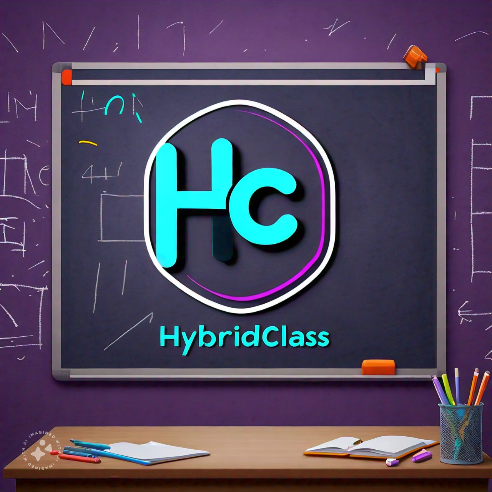
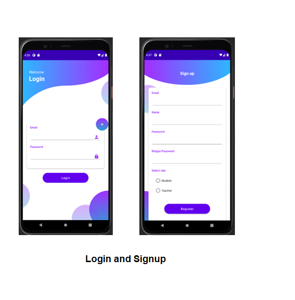
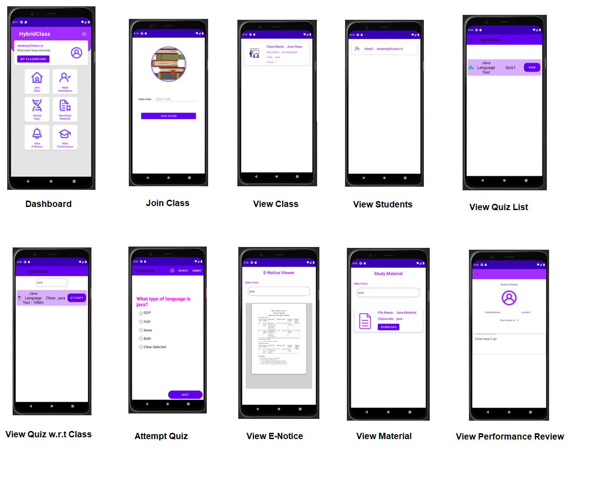
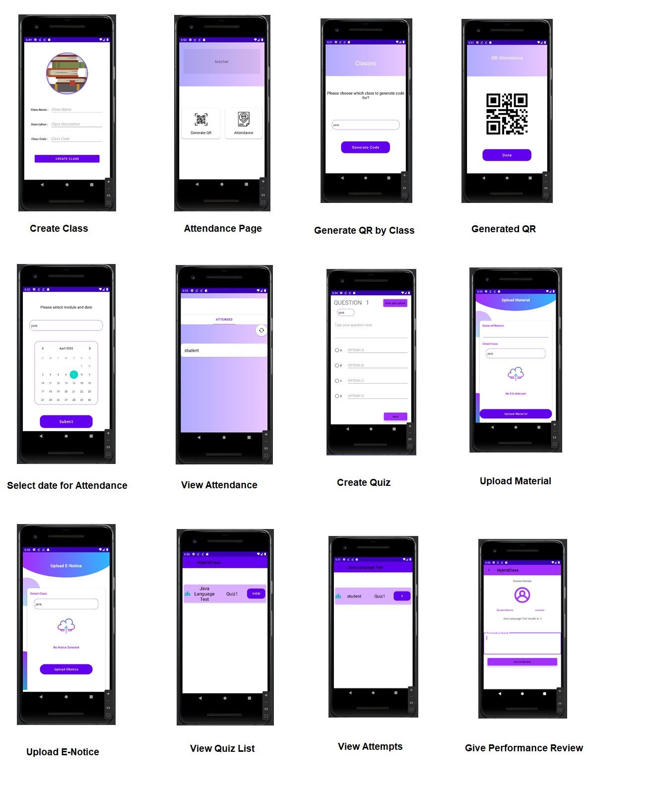

# HybridClass

HybridClass promotes a greater count of students to splurge in the field of education. It integrates the benefits of a physical classroom with the convenience of a ‘no-physical-bar’ virtual learning environment, minus the commuting hazards and expenses. It will usher in immense flexibility and sophistication in the existing learning platform structures, with the perfect blend of synchronous and asynchronous interaction. It provides a means of collaborative learning for the students.

## Purpose

HybridClass promotes a greater count of students to splurge in the field of education. It integrates the benefits of a physical classroom with the convenience of a ‘no-physical-bar’ virtual learning environment, minus the commuting hazards and expenses. It will usher in immense flexibility and sophistication in the existing learning platform structures, with the perfect blend of synchronous and asynchronous interaction. It provides a means of collaborative learning for the students.

## Scope

- Students can choose courses, attend lectures, take quizzes, view their attendance record, and progress report, etc. as per their convenience.
- Faculty can take lectures, upload assignments, make announcements, evaluate answer sheets, and upload lectures and other discussions in various formats such as videos and PowerPoint presentations.
- Upload and download various assignments, college notices, student notices, journals, and videos.

## Objective

Our main motto is to provide a simple and efficient way to improve access to advanced educational experiences by allowing students and faculties to participate in remote learning communities using personal computers and phones and to improve the quality and effectiveness of education to support collaborative learning.

## Technology and Literature Review

We used XML as our front-end in which we designed numerous user interfaces for our Android application using material design. For the backend, we used Java, which helps to control the user interface efficiently. Our database is Firebase.

### UI Screenshots

#### 1. Login and Singup

#### 2. Student Module

#### 3. Teacher Module

